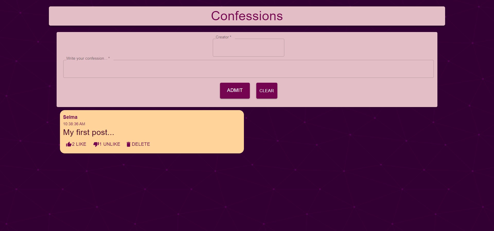

# confessions app client

[](https://github.com/prettier/prettier)


https://confessions-app-client.vercel.app/



## Getting started

```
git clone https://github.com/scokljat/confessions-app-client.git
```

.env

    REACT_APP_API_URL = REACT_APP_API_URL

To start the service run:

```
npm install
npm start
```

## License

[MIT](LICENSE)
